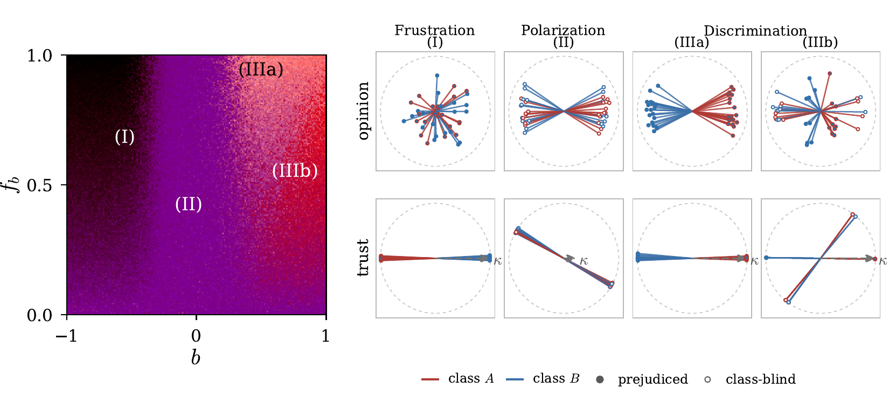

# Discrimination in a society of neural networks

Can a population of learning agents sort itself into mutually distrustful groups
along a label that carries no information — with no biased data, and no
group-level preference anywhere in the system?

It can. This repository derives the learning rule that does it, simulates the
society it produces, and maps the result as a phase diagram.

---

## Four phases, and a sharp move between them



We assign agents an irrelevant group label and give a fraction `f_b` of them a
group bias of strength `b`. Although the label contains no information about the
issues, repeated interactions can organize both trust and opinion around it. We
map the resulting collective states using three order parameters that measure
opinion–trust, trust–class, and opinion–class alignment. The portraits show
representative opinion and trust configurations from each of the four states:

- **(I) Frustrated out-group favoritism.** For `b < 0`, sufficiently common bias
  makes agents favor the out-group: members of the same class tend to distrust
  one another while trusting the other class. These relations cannot form
  consistent camps, so the trust network is frustrated and opinions remain
  incoherent.

- **(II) Nondiscriminatory polarization.** For `b ≈ 0` or `f_b ≈ 0`, agents
  separate into two camps whose members agree with and trust one another while
  distrusting the opposing camp. Class does not predict camp membership: the
  population is polarized but not discriminatory.

- **(IIIa) Discrimination with opinion alignment.** For `b > 0`, sufficiently
  common bias makes the class boundary the boundary between the two camps.
  Agents tend to trust their own class, distrust the other class, and hold
  opposing opinions. Discrimination in trust is reinforced by disagreement.

- **(IIIb) Discrimination without opinion alignment.** Trust follows class, but
  opinion does not. Agents favor their own class even though the two classes do
  not hold systematically different opinions.

And the move between phases is sharp. A single discriminating agent is biased by
`O(b)`; the population is not, shifting phase over a narrow interval in `b` once
`f_b` passes a threshold. **A protocol that inspects agents one at a time can
certify every agent as approximately unbiased while the population sits in a
discriminatory phase.** Auditing a multi-agent system needs population-level
order parameters.

---

## Layout

| | |
|---|---|
| [`paper/`](paper/) | The manuscript. `main.tex` builds `main.pdf`; every figure in it is produced by a script here. |
| [`nn-based-simulation/`](nn-based-simulation/) | The society of perceptron agents, the order parameters, the sweeps, and the figure above. |
| [`llm-agent-modulation/`](llm-agent-modulation/) | The modulation functions measured on LLM in-context learning, with frozen weights. Appendix E of the paper. |
| [`directional-prejudice/`](directional-prejudice/) | The other components of the group-bias field. A class-dependent shift has four; the paper studies one, and this one studies `c`, the status field, in which a class is believed more by everyone including its own members. Invisible to every order parameter above. Exploratory. |
| [`credulity-asymmetry/`](credulity-asymmetry/) | The mirror of that: `d`, in which one class believes everyone and the other believes nobody, itself included. Invisible for the same reason, and to the paper's parameters *indistinguishable* from `c` -- the two trust matrices are transposes, and the published five use only the symmetric part. `(d, f_d)` at the paper's own resolution. Exploratory. |
| [`uniform-credulity/`](uniform-credulity/) | The fourth component, the one that refers to no label: a uniform shift of the trust separatrix. Its plane is credulity against suspicion, and it is also the control the class order parameters are read against. Exploratory. |
| [`landau-small-cv-phase/`](landau-small-cv-phase/) | A toy Landau-style derivation of the small-`C`, small-`V` corner. |

## Start here

```bash
cd nn-based-simulation
pip install -r requirements.txt
python scripts/make_all.py --preset quick    # every figure, a few minutes
pytest
```

`--preset quick` trades resolution for time; `make_all.py` also takes `medium`
and `full`. Sweeps are cached, so restyling a figure does not re-simulate it.
Then [`nn-based-simulation/README.md`](nn-based-simulation/README.md) for what
each figure shows and where every parameter comes from.
