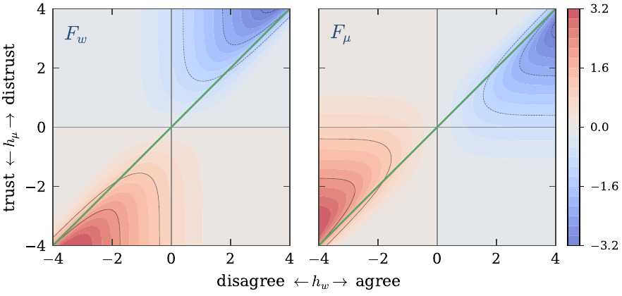
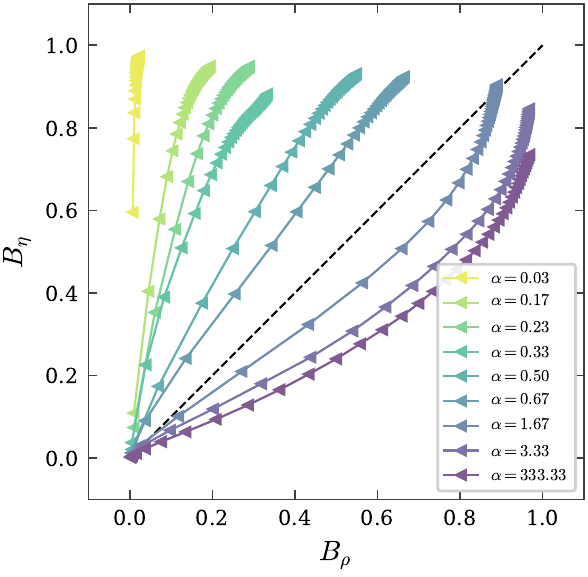
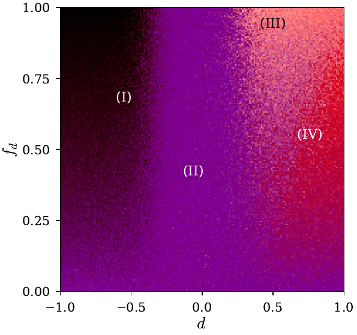

# Discrimination in a society of neural networks

Can a population of learning agents sort itself into mutually distrustful groups
along a label that carries no information — with no biased data, and no
group-level preference anywhere in the system?

It can. This repository derives the learning rule that does it, simulates the
society it produces, and maps the result as a phase diagram. Three results, in
the order they build on each other.

---

### 1. Learning is driven by dissonance



Each agent holds a belief about the **issue** (do I agree with this message?) and
a belief about the **source** (do I trust whoever said it?). A Bayesian step
updates both, and the whole update collapses onto two fields: the opinion field
`h_w` and the distrust field `h_mu`.

Nothing happens where a message is unsurprising. Everything happens in the two
dissonant quadrants — agreeing with someone you distrust, disagreeing with
someone you trust. Three properties fall out, none put in by hand:

- **trust gates learning and can invert it** — a distrusted source is not ignored
  but *anti-learned* from, which generates antiferromagnetic couplings;
- **agreement builds trust** — symmetrically, the sign of perceived agreement
  decides whether trust rises or falls;
- **only one sector yields at a time** — the two panels are mirror images, and
  the surprise is absorbed by whichever belief is held less firmly. Blame
  attribution, emerging from the inference problem rather than assumed.

These functions are a property of the *problem*, not of the network. Asked the
same questions in its context window, a large language model with frozen weights
reproduces the trust one — see [`llm-agent-modulation/`](llm-agent-modulation/).

### 2. The agenda decides which polarization comes first



With no bias anywhere, the society polarizes on its own, into exactly two camps.
But it can polarize in *opinion* (agents stop agreeing) or in *trust* (agents
stop trusting), and which one leads is set by the complexity of the agenda,
`alpha = P/K` — issues in play per dimension available to represent them.

Simple agendas run above the diagonal: distrust forms first. Complex agendas run
below it: disagreement forms first. The crossover sits at `alpha ~ 1.7`.

### 3. Four phases, and a sharp move between them



Now add a discrimination field: a bias of strength `d` carried by a fraction
`f_d` of the agents, which shifts where blame for a surprise falls. Three
correlation order parameters, composited as colour channels, name four
collective states — from mutual tolerance through to a fully discriminating
society.

And the move between phases is sharp. A single discriminating agent is biased by
`O(d)`; the population is not, shifting phase over a narrow interval in `d` once
`f_d` passes a threshold. **A protocol that inspects agents one at a time can
certify every agent as approximately unbiased while the population sits in a
discriminatory phase.** Auditing a multi-agent system needs population-level
order parameters.

---

## Layout

| | |
|---|---|
| [`paper/`](paper/) | The manuscript. `main.tex` builds `main.pdf`; every figure in it is produced by a script here. |
| [`nn-based-simulation/`](nn-based-simulation/) | The society of perceptron agents, the order parameters, the sweeps, and all three figures above. |
| [`llm-agent-modulation/`](llm-agent-modulation/) | The modulation functions measured on LLM in-context learning, with frozen weights. Appendix E of the paper. |
| [`directional-prejudice/`](directional-prejudice/) | The other components of the prejudice field. A class-dependent shift has four; the paper studies one, and this one studies `c`, the status field, in which a class is believed more by everyone including its own members. Invisible to every order parameter above. Exploratory. |
| [`credulity-asymmetry/`](credulity-asymmetry/) | The mirror of that: `b`, in which one class believes everyone and the other believes nobody, itself included. Invisible for the same reason, and to the paper's parameters *indistinguishable* from `c` -- the two trust matrices are transposes, and the published five use only the symmetric part. `(b, f_b)` at the paper's own resolution. Exploratory. |
| [`uniform-credulity/`](uniform-credulity/) | The fourth component, the one that refers to no label: a uniform shift of the trust separatrix. Its plane is credulity against suspicion, and it is also the control the class order parameters are read against. Exploratory. |
| [`landau-small-cv-phase/`](landau-small-cv-phase/) | A toy Landau-style derivation of the small-`C`, small-`V` corner. |

## Start here

```bash
cd nn-based-simulation
pip install -r requirements.txt
python scripts/make_all.py --preset quick    # every figure, a few minutes
pytest
```

`--preset quick` trades resolution for time; `make_all.py` also takes `medium`
and `full`. Sweeps are cached, so restyling a figure does not re-simulate it.
Then [`nn-based-simulation/README.md`](nn-based-simulation/README.md) for what
each figure shows and where every parameter comes from.

## A note on provenance

The model comes from an unpublished manuscript by Caticha et al., which is not
committed here. That draft is the guide for this work, not its organizing
principle: the simulation stands on its own, and where a literal reading of the
draft does not work, the code follows the model and the discrepancy is recorded
in the paper's appendices rather than silently reproduced. Two are worth knowing
about before reading anything else — the sign of the discrimination field is
inconsistent between the draft's equations and its own figures, and the draft
states no simulation parameters at all, so they are calibrated against features
of its published figures and tabulated with their provenance.

The PNGs in [`assets/`](assets/) exist only so this page renders on GitHub, which
cannot display PDFs inline. They are rasterized from `paper/figures/*.pdf`, which
remain the figures of record.
