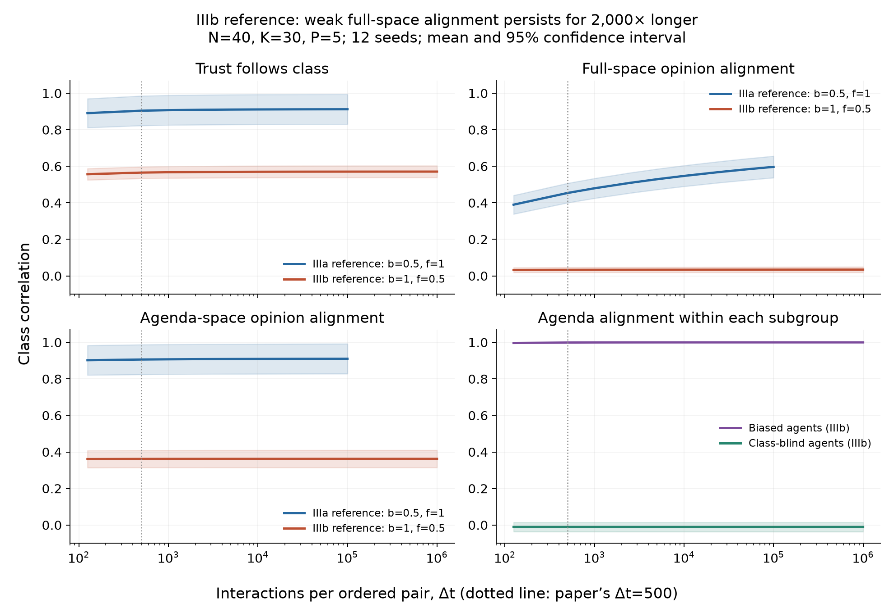

# Does IIIb eventually become IIIa?

## Finding

The experiments favor a persistent weak-full-space-alignment regime at the
paper's representative IIIb point, rather than delayed convergence to the IIIa
reference. Increasing the simulation duration alone does not make that point look
like IIIa over the tested times. This supports retaining the distinction between
the observed regimes, with more precise language about what is ordered.

At the IIIb reference, twelve unmodified societies reach Δt=1,000,000,
**2,000 times the paper’s duration**. Mean full-space opinion–class alignment
changes from 0.03317 to 0.03438; the paired change has a 95% confidence interval
of [−0.00066, 0.00308]. Small opinion perturbations and restoring opinion
uncertainty also leave this weak-alignment configuration intact.

There is also a substantive qualification: IIIb is **not devoid of opinion–class
alignment**. Biased agents are strongly class-aligned within the agenda. Their
small agenda weights, the frozen off-agenda components, and the class-blind
agents' different opinion camps make the full-space population correlation small.
The distinction is therefore more informative as **strong versus weak full-space
opinion alignment**, together with the different organization of the subgroups.

Finite simulations do not establish two distinct thermodynamic phases. In
particular, these tests do not prove that the whole IIIb region survives the joint
infinite-time and infinite-population limits or locate a sharp phase boundary.

## Direct lifetime test

We use the paper's own portrait points: IIIa at (b,f_b)=(0.5,1) and IIIb at
(1,0.5). Both use N=40, K=30, P=5. Twelve independent societies are followed along
continuous trajectories; comparisons between observation times are paired within
society. The full protocol and executable commands are in README.md.

At Δt=100,000, 200 times the manuscript's observation time:

| Reference point | R_cw at 500 | R_cw at 100,000 | R_mu,c at 100,000 | Agenda-only R_cw at 100,000 |
|---|---:|---:|---:|---:|
| IIIa: b=0.5, f_b=1 | 0.45393 | 0.59691 | 0.91226 | 0.91060 |
| IIIb: b=1, f_b=0.5 | 0.03317 | 0.03413 | 0.57082 | 0.36247 |

These are means over the twelve realizations. `results/summary.json` contains
95% confidence intervals for levels and paired changes at every tested point.
Trust at the representative IIIb point is only partially class-organized at the
population level: R_mu,c is about 0.57, not approximately one.

The additional continuation, perturbation, and size results are recorded in the
completed-results section below. See `figures/central_result.png` for the primary
comparison and `figures/trajectories_P5.png` for all seven baseline points.

## Why weak full-space alignment can persist

The microscopic diagnostics at IIIb support the following mechanism.

1. **Biased and class-blind receivers organize trust differently.** At Δt=100,000,
   biased receivers' mean trust–class correlation is 0.99960. Class-blind receivers'
   corresponding correlation is only 0.09383, but their trust alignment with
   stated-opinion agreement is 0.99943. These are receiver-conditioned averages
   over directed, non-self channels and all twelve societies.

2. **The biased receivers face conflicting opinion signals.** A class-blind
   speaker can belong to the receiver's class while holding an opposing opinion.
   A receiver whose trust follows class is consequently pulled in competing
   directions. At fixed late-time trust and speaker signs, the expected
   log-evidence has a finite local maximum for each biased receiver's agenda
   opinion vector. This differs from a receiver whose trust consistently follows
   its own opinion camp.

3. **The measured biased weights are already close to those finite optima.**
   The mean agenda norm is 1.17192 for biased agents and 8.07464 for class-blind
   agents. Across all 253 biased agents in the twelve societies, the mean distance
   from the actual agenda vector to its optimized conditional equilibrium is
   0.00237 (maximum 0.00535). Every fitted equilibrium has negative-definite
   log-evidence curvature; the largest eigenvalue across agents is −0.01365.
   These results come from directly averaging the original field updates over
   all possible emitters and agenda issues, then optimizing with the environment
   held fixed. They are not a fitted Landau model.

4. **The frozen complement dilutes the biased agents' aligned opinions.** For
   P=5, learning acts in five dimensions while 25 orthogonal dimensions retain
   their initial weights. A finite, small agenda norm leaves the normalized full
   vector dominated by those unaligned components. Meanwhile, strong class-blind
   opinion camps remain poorly correlated with class.

The conditional calculation uses, for each receiver r,

$$
L_r(u)=\frac{1}{(N-1)P}\sum_{e\ne r,p}
\log Z\!\left(\frac{\sigma_{e,p}u\cdot x_p}{\gamma_{C,r,p}}
+D_{r,e},\frac{\mu_{r,e}}{\sqrt{1+V_{r,e}}}\right).
$$

Holding the environment and current covariance fixed gives
$\mathbb{E}[\Delta u_r]=C_r\nabla L_r(u_r)$. The reported equilibria satisfy
$\nabla L_r\approx0$ and $\nabla^2L_r\prec0$. Since $C_r$ is positive definite,
the corresponding conditional mean drift is locally restoring; reducing $C_r$
changes its speed, rather than creating the zero of the drift. The code retains
the measured, unsaturated trust values in this calculation.

This is evidence for a locally maintained configuration, not just the assertion
that learning rates become small. The conditional stability calculation alone
would not prove stability of the fully coupled society: trust and speaker signs
were held fixed. The actual continued trajectories and interventions test that
limitation empirically.

The conservation law in the manuscript should also be stated carefully. A fixed
orthogonal component gives an **instantaneous dilution factor**, not a universal
time-independent ceiling: the accessible weight norm can grow. It does grow at
the IIIa reference. The additional observation that biased weights approach
finite conditional optima is what makes conservation relevant to persistent weak
alignment at the IIIb reference.

## Duration still matters near the apparent boundary

On the simple-agenda b=1 cut, the mean full-space opinion–class correlation changes
as follows between Δt=500 and 100,000:

| Biased fraction f_b | At 500 | At 100,000 |
|---|---:|---:|
| 0.5 | 0.03317 | 0.03413 |
| 0.75 | 0.14995 | 0.20266 |
| 0.9 | 0.31861 | 0.49057 |

At f_b=0.9, the binary stated-opinion class correlation stays at 0.83226 and the
agenda-vector correlation changes only from 0.82987 to 0.83174. A changing RGB
color or full-space threshold can therefore reflect increasing weight norms and
less dilution, without a new class organization of stated opinions. The current
manuscript's short doubling check is not a general convergence demonstration.

The complex-agenda controls use the same seven parameter points and twelve seeds,
through Δt=10,000. They are a shorter-duration comparison, not a replication of
the million-time simple-agenda extension. With a full-rank agenda there is no
orthogonal dilution, and the representative (b,f_b)=(1,0.5) has substantially more
full-space opinion alignment already at Δt=500. See the completed-results table
and `figures/trajectories_P100.png`.

## Suggested manuscript changes

- Describe IIIb as discrimination with **weak population-level full-space
  opinion–class alignment**, and explain the biased/class-blind decomposition.
  Avoid implying that every subgroup's opinions are uncorrelated with class.
- State that these are observed dynamical regimes and that a sharp asymptotic
  phase distinction has not yet been established.
- Replace the universal-sounding duration justification with the actual duration
  scan, reporting paired changes and variability across realizations.
- Include agenda-projected and stated-opinion correlations alongside the original
  R_cw when discussing IIIa versus IIIb. This separates reorganization of opinions
  from the changing dilution of their vectors.
- Do not increase Δt specifically to force every discriminatory point into IIIa.
  Instead, use a uniform duration protocol, or a documented convergence rule
  based on successive time doublings with a fixed maximum duration. If stopping
  times vary across the map, report them and mark points that have not converged.
  Retain both full-space and agenda diagnostics when deciding convergence.

A possible replacement paragraph is:

> In the weak-opinion-alignment discriminatory regime, biased receivers organize
> trust and their agenda-projected opinions around class, whereas class-blind
> receivers retain opinion-based trust camps that are weakly related to class.
> Conflicting messages keep the biased receivers' agenda weights near finite
> conditional equilibria; their conserved off-agenda components then dilute
> full-space opinion alignment. Long-duration simulations support persistence of
> this configuration at representative parameters. We therefore distinguish the
> observed regimes while leaving their asymptotic phase status open.

## Numerical and statistical limits

The accelerated simulation is the same update rule in exact agenda coordinates,
with float64 state and the original safeguards. Identical-schedule checks against
the copied original implementation reproduce weights, full covariances, trust
means, and variances to less than 8×10⁻¹⁵ after 5,000 updates for both agenda
sizes. Saving and resuming a checkpoint gives bitwise-identical states to an
uninterrupted continuation on the same schedule. Safeguard counts and the minimum
covariance eigenvalue are reported below.

Confidence intervals are across twelve independent seed realizations at a
specified parameter point. They do not certify phase boundaries, bound extremely
rare escape probabilities at later times, or justify extrapolating all points to
infinite time. The N=60 check is a finite-size robustness check at one point,
not a finite-size scaling study. Perturbations and covariance resets are
explicitly modified-dynamics probes, not additional unmodified baseline runs.

## Completed continuation and robustness results

All 180 baseline societies and 36 continuation/probe branches completed. The twelve unmodified long continuations extend the same IIIb societies to Δt=1,000,000, **2,000 times** the paper’s observation duration. Values below are means with across-seed 95% confidence intervals.

| Test | Final Δt | Full-space R_cw |
|---|---:|---:|
| Unmodified IIIb continuation | 1,000,000 | 0.03438 [0.01890, 0.04986] |
| 1% agenda-weight perturbation at 100,000 | 200,000 | 0.03421 [0.01896, 0.04945] |
| Agenda covariance reset to identity at 100,000 | 200,000 | 0.03488 [0.01871, 0.05105] |

The paired R_cw change from 500 to 1,000,000 is **0.00121 [-0.00066, 0.00308]**. Final individual-society values range from -0.00125 to 0.07389. This remains far below the IIIa reference mean of 0.59691 at 100,000.

The 1% perturbation changes R_cw relative to the matched unmodified continuation at 200,000 by -0.00000 [-0.00004, 0.00004].
Resetting agenda covariance changes R_cw relative to the matched unmodified continuation at 200,000 by 0.00067 [-0.00036, 0.00170].

The maximum fraction of stated-opinion signs differing from the 100,000 checkpoint at a recorded later observation is 0.00000 across these arms. This checks the sampled states; signs were not logged at every interaction.

The small perturbation and uncertainty reset both leave the weak-alignment configuration intact over their tested horizons. Together with the conditional equilibrium calculation, this argues against small opinion covariance being the sole reason IIIb has not become IIIa. Resetting opinion covariance does not reset trust variance or test arbitrary basin-changing perturbations.

| Additional comparison at (b,f_b)=(1,0.5) | R_cw at 500 | R_cw at final time | Final Δt |
|---|---:|---:|---:|
| Larger population: N=60, P=5 | 0.03886 [0.01853, 0.05919] | 0.04238 [0.01908, 0.06567] | 100,000 |
| Complex agenda: N=40, P=100 | 0.42668 [0.35257, 0.50078] | 0.42674 [0.35301, 0.50047] | 10,000 |

Across all recorded baseline and probe states, the minimum agenda-covariance eigenvalue is 2.45e-07, and the minimum non-self trust variance is 1.59e-05. No PSD clips, evidence-floor activations, or trust-variance-floor activations occurred.

The result supports persistence of IIIb at the representative parameters. It does **not** establish that every point labeled IIIb is an asymptotically distinct phase, nor that the IIIa/IIIb boundary is a sharp transition rather than a crossover.
